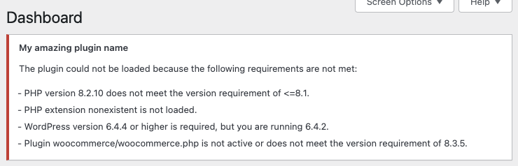

<p align="center"><picture>
  <source media="(prefers-color-scheme: dark)" srcset="https://fabrikage.nl/assets/img/logo-alt.svg">
  
</picture></p>

# <p align="center">fabrikage/requirements</p>

<p align="center">An elegant solution to check if your PHP application meets the requirements to run on a server.</p>

\
&nbsp;

## Requirements

Will be added soon.

## Installation with Composer

```bash
composer require fabrikage/requirements
```

## Usage

Valid version strings are:
- `1` Major
- `1.0` Major and minor
- `1.0.0` Major, minor and patch

*Or anything that is readable by `version_compare()`.*

Valid comparators are:
- `=` Equal to
- `!=` Not equal to
- `>` Greater than
- `>=` Greater than or equal to
- `<` Less than
- `<=` Less than or equal to

The default comparator, when none is provided is `>=`.

A version string with a comparator looks like this: `>=1.0.0`.

### Example

```php
require_once __DIR__ . '/vendor/autoload.php';

use Fabrikage\Requirements;
use Fabrikage\Requirements\Requirement;

$requirements = [
    new Requirement\PHP('8.1'),
    new Requirement\PHPExtension('curl'),
    new Requirement\WordPress('6.4.1'),
    new Requirement\WordPressPlugin('woocommerce/woocommerce.php', '8.3.1'),
];

// Pass false to the constructor to disable exception throwing, leave empty to enable.
$validator = new Requirements\Validator(false);
$validator->addRequirements($requirements);

if (!$validator->valid()) { 
    // Your application does not meet the requirements.
}

// Alternatively, you can invoke the validator as a function.
if (!$validator()) {
    // Your application does not meet the requirements.
}

App::run();
```

### WordPress example
```php
use Fabrikage\Requirements\Validator;

class App
{
    private static Validator $validator;

    public static function run(Validator $validator): void
    {
        if (!$validator->valid()) {
            static::$validator = $validator;
            static::handleErrors($validator);

            return; // Block further execution
        }

        static::init();
    }

    private static function init(): void
    {
        // Initialize your application
    }

    private static function handleErrors(): void
    {
        add_action('admin_notices', function () {
            static::renderErrors();
        });
    }

    private static function renderErrors(): void
    {
        if (empty($errors = static::$validator->getErrors())) {
            return;
        }

        echo sprintf(
            '<div class="notice notice-error"><p><strong>%s</strong></p><p>%s</p><ul>%s</ul></div></p>',
            PLUGIN_NAME,
            __('The plugin could not be loaded because the following requirements are not met:', 'plugin-name'),
            implode('', array_map(function (string $error) {
                return sprintf('<li>- %s</li>', $error);
            }, $errors))
        );
    }
}
```

This would result in the following output if not all requirements are met:

